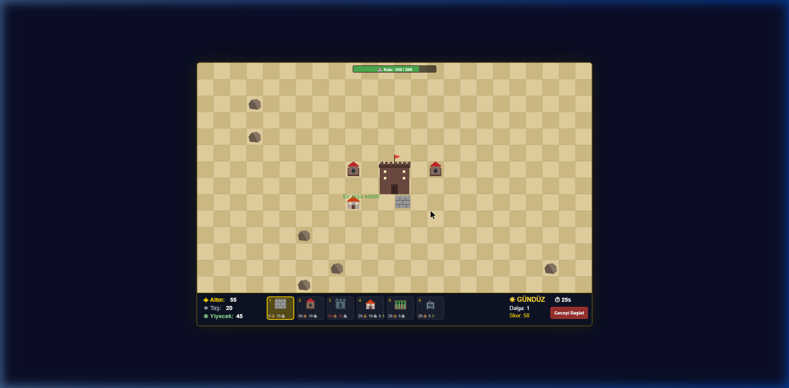
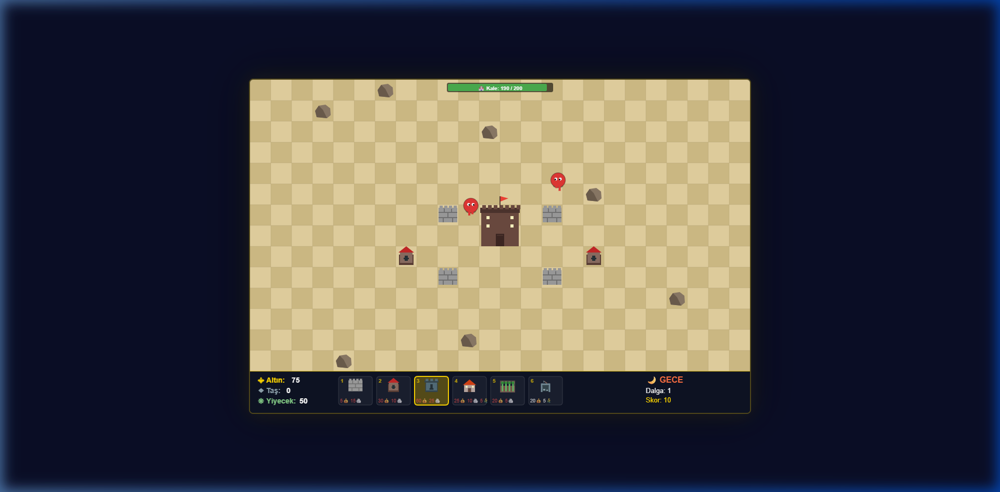

# ⚔ Kum Kalesi - Çöl Savunma Oyunu ⚔

HTML5 Canvas ve JavaScript ile geliştirilmiş 2D tower defense (kale savunma) oyunu.

## 🎮 Oyun Hakkında

Kum Kalesi, çöl ortamında geçen bir kale savunma oyunudur. Gündüz vakti binalarınızı inşa edin, gece düşman dalgalarından kalenizi koruyun!

### 🎯 Hedef / Zorluk (Challenge)
- Merkezdeki kalenizi düşman dalgalarına karşı savunun
- Her gece düşmanlar daha güçlü ve çeşitli olur
- Kaynakları akıllıca yönetip stratejik savunma hatları oluşturun
- Mümkün olduğunca çok gece hayatta kalın ve yüksek skor elde edin

### 🕹 Kontroller
| Kontrol | İşlev |
|---------|-------|
| **Fare (Sol Tık)** | Bina seçme ve yerleştirme |
| **Fare (Sağ Tık)** | Bina seçimini iptal etme |
| **1-6 Tuşları** | Hızlı bina seçimi |
| **Boşluk (Space)** | Geceyi erken başlatma |
| **Escape** | Seçimi iptal etme |
| **M** | Müzik aç/kapa |
| **S** | Ses aç/kapa |

## 📸 Oyun Ekran Görüntüleri

### Gündüz Fazı - İnşa Zamanı


### Gece Fazı - Savunma Zamanı


## 🏗 Bina Türleri

| Bina | Maliyet | İşlev |
|------|---------|-------|
| 🧱 Taş Duvar | 5💰 15🪨 | Düşmanları fiziksel olarak engeller |
| 🏹 Okçu Kulesi | 30💰 10🪨 | Yakın düşmanlara ok atar |
| 💣 Top Kulesi | 60💰 25🪨 | Alan hasarı verir |
| 🏠 Ev | 25💰 10🪨 5🌾 | Her gece 15 altın üretir |
| 🌾 Çiftlik | 20💰 5🪨 | Her gece 10 yiyecek üretir |
| ⛏ Maden | 20💰 5🌾 | Her gece 12 taş üretir |

## 👾 Düşman Türleri
- **İstilacı (Normal)**: Standart hız ve dayanıklılık
- **Koşucu (Hızlı)**: Yüksek hız, düşük can
- **Yıkıcı (Tank)**: Yavaş ama çok dayanıklı, yüksek hasar
- **Uçan**: Duvarları atlayabilir, kanatlarıyla uçar

## 🔧 Teknoloji
- **HTML5 Canvas** - Oyun rendering
- **Vanilla JavaScript** - Oyun mantığı (harici kütüphane yok)
- **CSS3** - Sayfa düzeni
- **Web Audio API** - Ses efektleri ve müzik

## 🎮 İlham Alınan Oyun
**Dune Keepers** - Brackeys Game Jam 2024.2 birincisi
- Bağlantı: [aznoqmous.itch.io/dune-keepers](https://aznoqmous.itch.io/dune-keepers)
- Tema: "Calm before the storm"
- Gündüz inşa / gece savunma döngüsü mekaniklerinden ilham alınmıştır.

## 📁 Proje Yapısı
```
├── index.html          # Ana HTML sayfası
├── css/
│   └── style.css       # Oyun stilleri
├── js/
│   ├── utils.js        # Yardımcı fonksiyonlar ve sabitler
│   ├── audio.js        # Web Audio API ses sistemi
│   ├── resources.js    # Kaynak yönetimi
│   ├── particles.js    # Parçacık efektleri
│   ├── grid.js         # Grid/harita sistemi
│   ├── buildings.js    # Bina sınıfları ve çizimleri
│   ├── enemies.js      # Düşman sınıfları ve dalga yönetimi
│   ├── projectiles.js  # Mermi sistemi
│   ├── ui.js           # Kullanıcı arayüzü
│   └── game.js         # Ana oyun döngüsü
├── assets/
│   ├── images/         # Ekran görüntüleri
│   └── sounds/         # Ses dosyaları
├── README.md           # Bu dosya
└── AI.md               # Yapay zeka kullanım dökümantasyonu
```

## 🎵 Asset Kaynakları
- Tüm görseller Canvas API ile kodlanarak çizilmiştir (harici görsel kullanılmamıştır)
- Ses efektleri Web Audio API ile programatik olarak üretilmektedir
